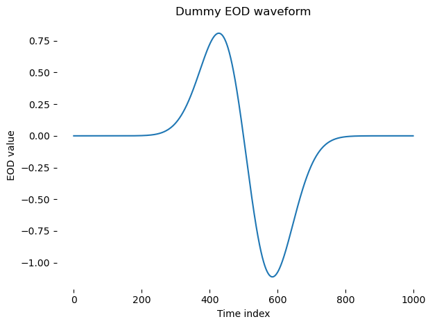
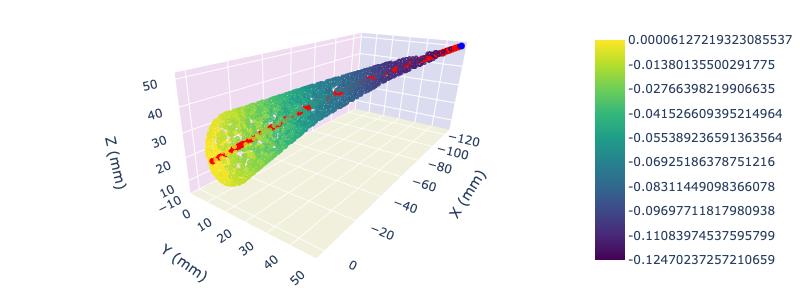
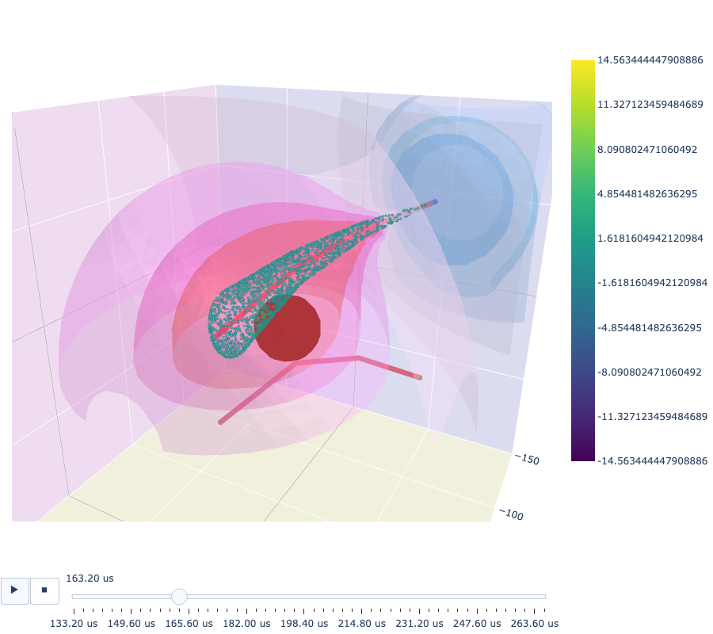

# Weakly Electric Fish Physics Model

## Intro
This model simulates weakly electric fish, boundaries and nearby objects. The main purpose of this framework is to study active electrolocation. It can be used for both pulse- and wave-type weakly electric fish. The `example-simulation.ipynb` notebook described below is a good way to get started with the framework. 

For further details on the simulation code, refer to the `objects/readme.md` documentation. This will help identify relevant functions needed for your specific application, and their expected input and output.

This code can be modified for various purposes, including to create different or more flexible visualizations within the relevant visualization methods provided with each class.

### Generating datasets
To generate large datasets for further use, you can use the provided methods for doing so. These methods provided functionality for creating, storing and loading electric signal data.

## Example Simulation

The `example-simulation.ipynb` notebook demonstrates what this framework does. It is a simple tutorial on how to use it. When running this notebook, you should see the figures below being generated as you run the code. Running the notebook should take less than 10s, and most of this time is due to constructing the interactive 3D visualizations. The computation time should be much less than 1s.

#### Dummy eod for simulation

#### Simple fish visualization in 3D
The receptors on the skin surface of the fish are color-coded by the x-axis position. Point currents that generate the EOD are along the midline of the fish (+red/-blue). Not in this example the fish is not straigth, rather it has tail bend at multiple locations to mimic a swimming fish.

#### simple aquarium visualization in 3D 
This includes a fish, a boundary (horizontal at z=0) that creates the image currents, and a worm. Receptor modulation due to worm presence should be noticeable on the skin, close to the worm (especially in the interactive plot). Equipotential surfaces are also shown during the fish discharge.

